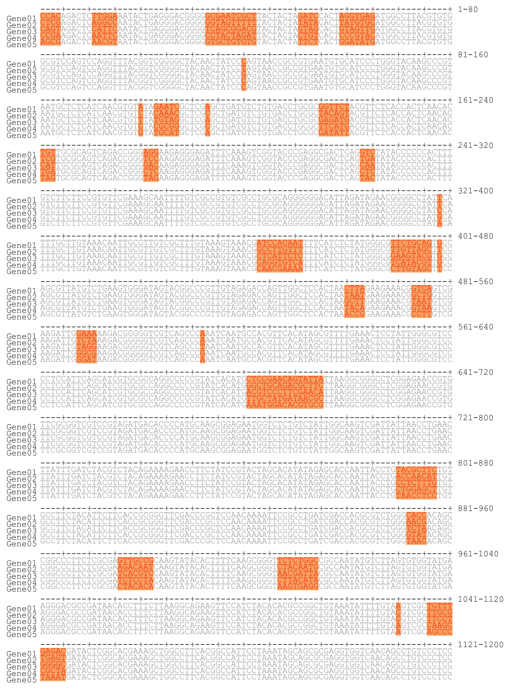

# bioplotz: A package for plotting images for bioinformatics

[](https://pypi.python.org/pypi/bioplotz)
[](https://pepy.tech/project/bioplotz)

## Dependencies

Python modules:

- numpy
- matplotlib
- pandas

## Installation

### Install via pip

```bash
pip install bioplotz
```

### Install from source code

```bash
pip install git+https://github.com/sc-zhang/bioplotz.git --user
```

## Usage

### Manhattan Plot

```python
import bioplotz as bp

fig, ax = bp.manhattan(data, threshold=0, color=['orange', 'green'], threshold_line_color='blue', log_base=0,
                       reverse=False, xtick_labels=True, ytick_labels=True, ax=None, marker='.', s=1, **kwargs)
```

| parameter                | value type    | explain                                                                                                                                                                                    |
|--------------------------|---------------|--------------------------------------------------------------------------------------------------------------------------------------------------------------------------------------------|
| **data**                 | dict<br>list  | **dict** key: block name<br>&ensp;&ensp;&ensp;&ensp;value: [[x1,x2,...,xn], [y1,y2,...,yn]]<br>**list** is a list like: [[x1,y1], [x2, y2], ..., [xn, yn]]                                 |
| **threshold**            | value<br>list | **value** if only one threshold line to plot, <br>**list** if more than one threshold line need to plot, a list can be used for different lines, like: [threshold_value1, threshol_value2] |
| **color**                | list          | **color** is a list used for blocks, if the count of block greater than color count, it will be used circularly                                                                            |
| **threshold_line_color** | value<br>list | **value** if **threshold** is a single value<br>**list** if **threshold** is a list                                                                                                        |
| **threshold_line_width** | value         | **value** the line width of threshold lines                                                                                                                                                |
| **block_line_width**     | value         | **value** if there are only one color, the block line will display as border, the width is set by this parameter                                                                           |
| **log_base**             | value         | log_base = 0 means not calucate value with log<br>log_base != 0 means log base for log values with it                                                                                      |
| **reverse**              | Boolean       | if all data lower than 0, you may use it to show opposite values                                                                                                                           |
| **other parameters**     | value         | same with parameters used in **pyplot.scatter**                                                                                                                                            |

<table align="center">
<tr>
<td></td>
</tr>
</table>

### Chromosome Plot

```python
import matplotlib.pyplot as plt
import bioplotz as bp

fig, ax, mapper = bp.chromosome(chr_len_db, chr_order, inner_data=bed_data, centro_db=centro_pos,
                                inner_value_type="numeric", orientation="vertical", **kwargs)
plt.colorbar(mapper, ax=ax, shrink=0.5)

# for drawing telomeres, we need a dict of telomeres
# the telomere dict is like below:
# chr_telo_db = {"Chr1": "start", "Chr2": "end", "Chr3": "both"}
# then add codes below
left_telo_list = []
right_telo_list = []
for _ in range(len(chr_order)):
    chrn = chr_order[_]
    if not chrn in chr_telo_db:
        continue
    if chr_telo_db[chrn] == "start":
        left_telo_list.append(_)
    elif chr_telo_db[chrn] == "end":
        right_telo_list.append(_)
    elif chr_telo_db[chrn] == "both":
        left_telo_list.append(_)
        right_telo_list.append(_)

# the value of color and s should be adjusted by user manually
plt.scatter([_ for _ in left_telo_list], [0 for _ in left_telo_list], color="blue", s=50)
plt.scatter([_ for _ in right_telo_list], [chr_len_db[chr_order[_]] for _ in right_telo_list], color="blue", s=50)

```

| parameter            | value type                      | Optional | Default      | explain                                                                                                                                                                                                                                                                                                           |
|----------------------|---------------------------------|----------|--------------|-------------------------------------------------------------------------------------------------------------------------------------------------------------------------------------------------------------------------------------------------------------------------------------------------------------------|
| **chr_len_db**       | dict                            | No       | -            | **key**: chromosome name<br>**value**: chromosome length                                                                                                                                                                                                                                                          |
| **chr_order**        | list                            | Yes      | None         | **list**: the custom chromosome order, like: ["Chr1", "Chr3", "Chr2"]<br>must same with keys in chr_len                                                                                                                                                                                                           |
| **inner_data**       | list                            | Yes      | None         | **list**: two dimension list, like: [[chrome name, start pos, end pos, value/color]]                                                                                                                                                                                                                              |
| **outer_data**       | list                            | Yes      | None         | same with **inner_data**                                                                                                                                                                                                                                                                                          |
| **centro_pos**       | dict                            | Yes      | None         | **key**: chromosome name<br>**value**: middle position of centromere                                                                                                                                                                                                                                              |
| **inner_value_type** | str                             | Yes      | numeric      | **numeric**: the 4th column of bed_data should be value<br>**color**: the 4th column of bed_data is color<br>**marker**: different with other two types, it need 5 columns, the 4th column of bed_data is marker, the 5th column is color (marker is same with the parameter which be used in **pyplot.scatter**) |
| **outer_value_type** | str                             | Yes      | numeric      | similar with **inner_value_type**, but only support **numeric** and **marker**                                                                                                                                                                                                                                    |
| **orientation**      | str                             | Yes      | vertical     | "vertical" or "horizontal"                                                                                                                                                                                                                                                                                        |
| **inner_vmin**       | float                           | Yes      | nan          | only affect when **inner_value_type** is **numeric**, if not set, the minimum value of **inner_data** would be use, otherwise, the value lower than vmin would be increased to vmin                                                                                                                               |
| **inner_vmax**       | float                           | Yes      | nan          | only affect when **inner_value_type** is **numeric**, if not set, the maximum value of **inner_data** would be use, otherwise, the value greater than vmax would be decreased to vmax                                                                                                                             |
| **outer_vmin**       | float                           | Yes      | nan          | only affect when **outer_value_type** is **numeric**, if not set, the minimum value of **outer_data** would be use, otherwise, the value lower than vmin would be increased to vmin                                                                                                                               |
| **outer_vmax**       | float                           | Yes      | nan          | only affect when **outer_value_type** is **numeric**, if not set, the maximum value of **outer_data** would be use, otherwise, the value greater than vmax would be decreased to vmax                                                                                                                             |
| **cmap**             | str                             | Yes      | gist_rainbow | **cmap** for colorbar                                                                                                                                                                                                                                                                                             |
| **cmap_parts**       | int                             | Yes      | 100          | how many parts for splitting cmap                                                                                                                                                                                                                                                                                 |
| **inner_size**       | float or array-like, shape(n,)  | Yes      | None         | size of marker size if **inner_value_type** is **marker**                                                                                                                                                                                                                                                         |
| **outer_size**       | float or array-like, shape(n, ) | Yes      | None         | same with **inner_size**                                                                                                                                                                                                                                                                                          |
| **outer_line_color** |                                 | Yes      | None         | color of line if **outer_value_type** is **numeric**                                                                                                                                                                                                                                                              |
| **outer_line_style** |                                 | Yes      | None         | style of line if **outer_value_type** is **numeric**                                                                                                                                                                                                                                                              |
| **fig_ratio**        | float                           | Yes      | None         | if plot with subplots, use this parameter to keep the arcs of chromosomes correct, for "vertical", this parameter should be fig_width/fig_height, otherwise, fig_height/fig_width                                                                                                                                 |
| **other parameters** | value                           | Yes      | None         | same with parameters used in **pyplot.plot**                                                                                                                                                                                                                                                                      |

- If value_type is numeric, the return value mapper will be a mappable which could be used with plt.colorbar, else None

<table align="center">
<tr>
<td></td>
<td></td>
</tr>
</table>

### Gene Cluster Plot

```python
import bioplotz as bp

fig, ax = bp.genecluster(gene_list)
```

| parameter     | value type  | Optional | Default | explain                                                                                                                                          |
|---------------|-------------|----------|---------|--------------------------------------------------------------------------------------------------------------------------------------------------|
| **gene_list** | list        | No       | -       | **list**: 2-dimension list, like [[gene name, start pos, end pos, direct(+/-), color], ..., [gene name, start pos, end pos, direct(+/-), color]] |
| **edgecolor** | list<br>str | Yes      | None    | **list**: same length with gene_list, like: ["green", "blue", ..., "red"]<br>**str**: common edge color for all genes                            |
| **edgewidth** | int         | Yes      | 1       | edge width for all genes                                                                                                                         |
| **lw**        | int         | Yes      | 3       | line width to show the genome backbone                                                                                                           |

**Notice**, the best figsize should be (gene count, 1), for example: plt.figure(figsize=(16, 1)), and the bbox_inches
parameter which in savefig should be 'tight'.

<table align="center">
<tr>
<td></td>
</tr>
</table>

### Multi Alignment Plot

```python
import bioplotz as bp

fig, ax = bp.multialign(data)
```

| parameter         | value type | Optional | Default | explain                                             |
|-------------------|------------|----------|---------|-----------------------------------------------------|
| **data**          | dict       | No       | -       | **key**: gene name<br>**value**: alignment sequence |
| **base_per_line** | int        | Yes      | 80      | base count to display for each line                 |
| **color_mode**    | string     | Yes      | match   | should be one of "match" and "base"                 |
| **color_kws**     | dict       | Yes      | -       | based on color_mode, details could be found below   |
| ****kwargs**      | any        | Yes      | -       | same with which use in ax.text                      |

> **Details of color_kws**  
> if color_mod is "match", the struct and default values of color_kws is like below:
> ```python
> # the default color of background colors is "white", 
> # if there are not be set or set to None, 
> # the default color of text colors is "black",
> # if there are not be set or set to None
> # user can overwrite any of them by set color_kws like:
> # color_kws = {"match_color": "black", "match_background_color": "grey"} 
> color_kws = {
>     "match_color": 'blue',
>     "match_background_color": None,
>     "mismatch_color": 'red',
>     "mismatch_background_color": None,
>     "highlight_positions": None,
>     "highlight_color": 'green',
>     "highlight_background_color": None
> }
> ```
> if color_mod is "base", the struct and default values of color_kws is like below:
> ```python
> # the default color of text is "black" and default color of background is set below
> # user can overwrite color of any charactor or add color for new charactor like *, -, ?
> # by set color_kws like:
> # color_kws = {"base_color": {"-": "white}, "base_background_color": {"-", "yellow"}}
>
> color_kws = {
>     "base_color": {},
>     "base_background_color": {
>         "A": "salmon", "a": "salmon",
>         "T": "lightgreen", "t": "lightgreen",
>         "G": "orange", "g": "orange",
>         "C": "steelblue", "c": "steelblue",
>         "U": "tomato", "u": "tomato",
>         "F": "khaki", "f": "khaki",
>         "D": "cadetblue", "d": "cadetblue",
>         "N": "coral", "n": "coral",
>         "E": "yellowgreen", "e": "yellowgreen",
>         "Q": "plum", "q": "plum",
>         "H": "orchid", "h": "orchid",
>         "L": "darkseagreen", "l": "darkseagreen",
>         "I": "yellow", "i": "yellow",
>         "K": "lightseagreen", "k": "lightseagreen",
>         "O": "darkkhaki", "o": "darkkhaki",
>         "M": "palevioletred", "m": "palevioletred",
>         "P": "sandybrown", "p": "sandybrown",
>         "R": "palegreen", "r": "palegreen",
>         "S": "peru", "s": "peru",
>         "V": "violet", "v": "violet",
>         "W": "mediumturquoise", "w": "mediumturquoise",
>         "Y": "deepskyblue", "y": "deepskyblue"
>     }
> }
> ```
> colors for base:  
> 

**Notice**, the figsize should be (base_per_line/10, x) where x=align_length/base_per_line*gene_count/5, and the font
must be monospaced,
like "Courier New", that sometimes user need add codes as following.

```python
import matplotlib as mpl
import bioplotz as bp

basefont = mpl.font_manager.FontProperties(fname="/path/to/font.ttf")
fig, ax = bp.multialign(data, fontproperties=basefont)
```

or

```python
plt.rcParams['font.sans-serif'] = 'Courier New'
```

<table align="center">
<tr>
<td></td>
</tr>
</table>
